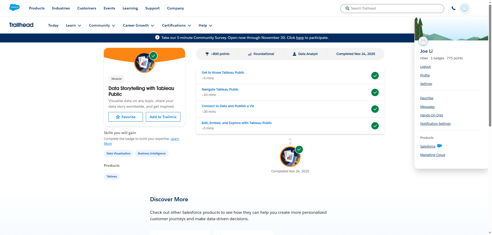
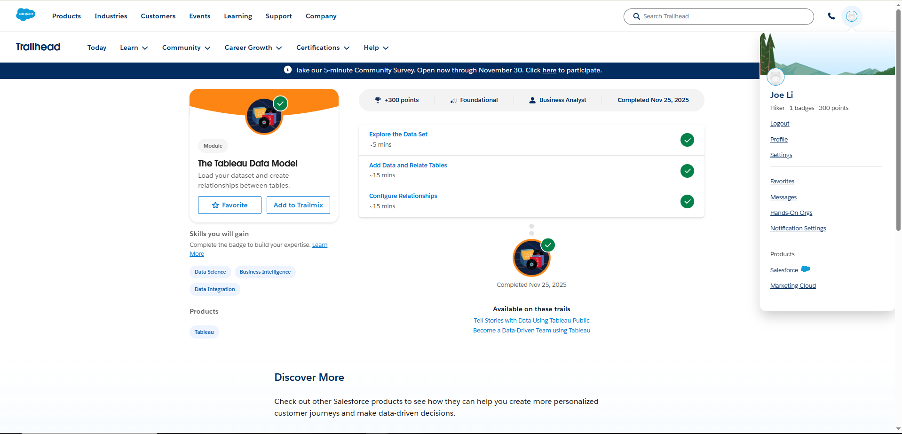
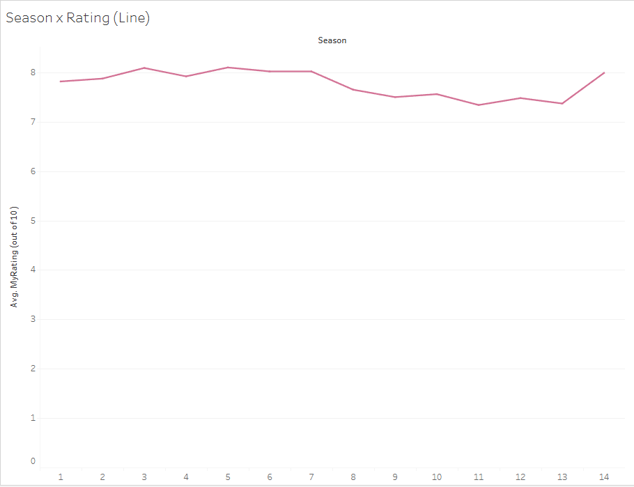
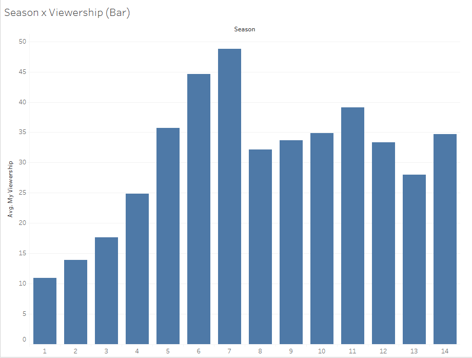

# tableau_trailhead_basics

Assignment 6

## Evidence Section
Data Story Telling

Tableau Data Model

## Public Viz

[Great British Bake Off - Season Rating Viz](https://public.tableau.com/views/GreatBritishBakeOff-SeasonRating/Sheet1?:language=en-US&:sid=&:redirect=auth&:display_count=n&:origin=viz_share_link)

My Viz shows that across the 14 seasons, later seasons have much higher average viewship than the early one, indicating that The Great British Bake Off steadily gained audience over time. Even though this is true, the average rating however, remain relatively the same. 

Season/Rating - Bar Graph

Season/Rating - Line Graph

Season/Viewship - Bar Graph

## Written Response

A key principle from Data Storytelling with Tableau Public is focusing on a single, clear message for the audience, which guided the choice to center the viz on how seasons differ in average rating and viewership rather than overcrowding it with extra fields. This led to two simple season-level lines that make it easy to see that audience size grows a lot over time while ratings stay consistently high. From The Tableau Data Model, the idea that relationships let Tableau keep tables at their own level of detail while automatically choosing the right joins during analysis is especially important, because it prevents duplicate rows and wrong aggregations when combining multiple real-world tables. In a healthcare setting, this matters when linking patient visits, lab results, and diagnoses: relationships can connect those tables on patient and encounter IDs while views in Tableau then tell clean stories about trends in readmissions or lab control without overcounting patients. Tableau is a good fit because it can visually summarize complex, multi-table clinical data into dashboards that clinicians and leaders can quickly understand and act on.